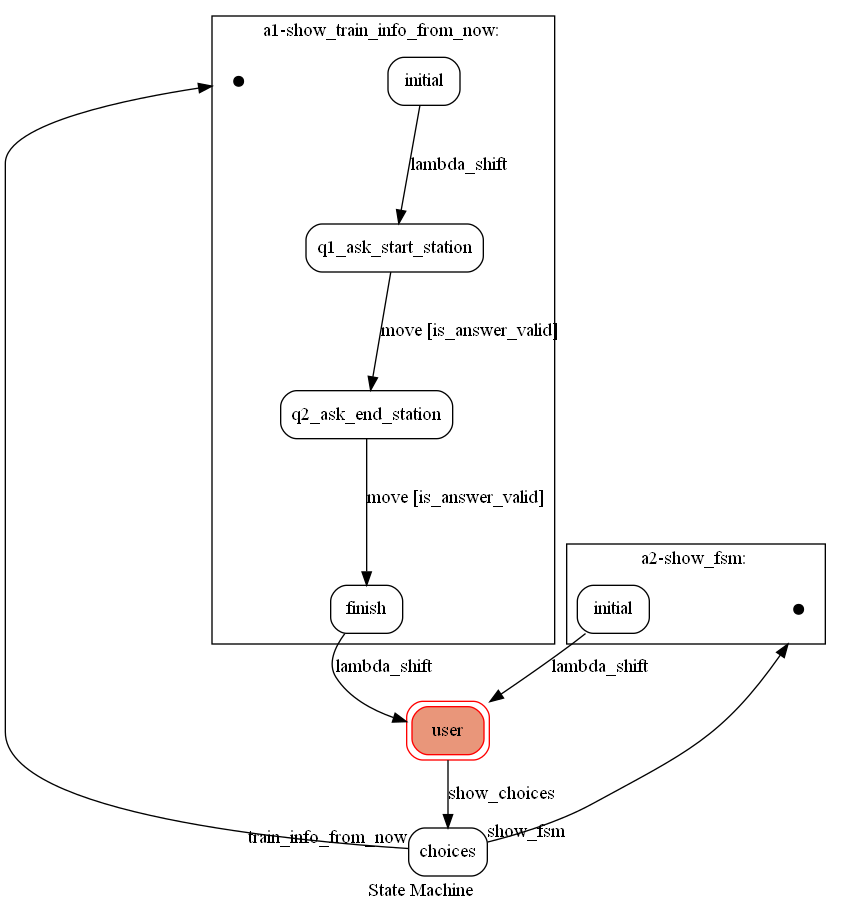

# TOC Project 2020

## Finite State Machine



## 主題：簡單的列車查詢

* API來源：https://ptx.transportdata.tw/PTX/

* line id: @672csbza

* 資料庫使用Mongodb

  * 雲端資料庫放在 https://www.mongodb.com/cloud

    > 免費版有500M :heart:

* 到heroku看fsm:https://panda-transport.herokuapp.com/show-fsm

### 功能

1. 依據起訖站、現在時刻查詢高鐵車次
2. 查詢台鐵某一車站的即時車況
3. 查詢高捷某一站的即時等候時間

* 格外功能 -> 查看fsm
  * 可在任意時候查看現在的state

### 環境變數

* LINE_CHANNEL_SECRET
* LINE_CHANNEL_ACCESS_TOKEN
* PORT
  * 讓heroku部署時，使用heroku的port
* MONGO_URL
  * 資料庫的連接網址
* HOST_NAME
  * 讓傳送fsm圖片到line時，圖片url正確能夠取得server的本地圖片

## Transition遇坑紀錄

> 因transition的問題，所以直接修改一點原碼，一起放上來

Transition: https://github.com/pytransitions/transitions

1. 使用HSM(Hierarchical State Machine)的child HSM裡面不能有internal transition

   > 因為transition的dest是None所造成的問題
   >
   > 我改成不用internal transition來避開問題

2. add_model無法執行graph的移動

   > 在原始碼GraphMachine加上push_model來將graph附加到model
   >
   > 在原始碼HierarchicalGraphMachine覆寫add_model來將graph附加到model

## pygraphviz環境安裝方法紀錄

### win10 Conda(印象中的安裝方法)

1. `conda create -n linebot python=3.6`

2. `conda activate linebot`

3. `conda install -c alubbock pygraphviz`

   > 安裝這個來源可以省去許多錯誤
   >
   > 網址: https://anaconda.org/alubbock/pygraphviz

4. `pip install -r requirements.txt`

### Heroku 部署

#### buildpacks(順序不能變)

1. heroku-community/apt

   > * 用此將格外安裝package放在Aptfile
   >
   > * Aptfile至少放這三項：
   >
   >   ```
   >   graphviz
   >   libgraphviz-dev
   >   pkg-config
   >   ```
   >
   > * 並且要注意Aptfile不能用windows的換行符號
   >
   >   > 相關issue：https://github.com/heroku/heroku-buildpack-apt/issues/53

2. https://github.com/weibeld/heroku-buildpack-graphviz

   > (印象中)只放1無法保存圖片，加上這個就可以

3. heroku/python

   > 安裝python程式所需的依賴包


<details>
<summary><strong>原本README</strong></summary>

------

[](https://codeclimate.com/github/NCKU-CCS/TOC-Project-2020/maintainability)

[](https://snyk.io/test/github/NCKU-CCS/TOC-Project-2020)


Template Code for TOC Project 2020

A Line bot based on a finite state machine

More details in the [Slides](https://hackmd.io/@TTW/ToC-2019-Project#) and [FAQ](https://hackmd.io/s/B1Xw7E8kN)

## Setup

### Prerequisite
* Python 3.6
* Pipenv
* Facebook Page and App
* HTTPS Server

#### Install Dependency
```sh
pip3 install pipenv

pipenv --three

pipenv install

pipenv shell
```

* pygraphviz (For visualizing Finite State Machine)
    * [Setup pygraphviz on Ubuntu](http://www.jianshu.com/p/a3da7ecc5303)
	* [Note: macOS Install error](https://github.com/pygraphviz/pygraphviz/issues/100)


#### Secret Data
You should generate a `.env` file to set Environment Variables refer to our `.env.sample`.
`LINE_CHANNEL_SECRET` and `LINE_CHANNEL_ACCESS_TOKEN` **MUST** be set to proper values.
Otherwise, you might not be able to run your code.

#### Run Locally
You can either setup https server or using `ngrok` as a proxy.

#### a. Ngrok installation
* [ macOS, Windows, Linux](https://ngrok.com/download)

or you can use Homebrew (MAC)
```sh
brew cask install ngrok
```

**`ngrok` would be used in the following instruction**

```sh
ngrok http 8000
```

After that, `ngrok` would generate a https URL.

#### Run the sever

```sh
python3 app.py
```

#### b. Servo

Or You can use [servo](http://serveo.net/) to expose local servers to the internet.


## Finite State Machine


## Usage
The initial state is set to `user`.

Every time `user` state is triggered to `advance` to another state, it will `go_back` to `user` state after the bot replies corresponding message.

* user
	* Input: "go to state1"
		* Reply: "I'm entering state1"

	* Input: "go to state2"
		* Reply: "I'm entering state2"

## Deploy
Setting to deploy webhooks on Heroku.

### Heroku CLI installation

* [macOS, Windows](https://devcenter.heroku.com/articles/heroku-cli)

or you can use Homebrew (MAC)
```sh
brew tap heroku/brew && brew install heroku
```

or you can use Snap (Ubuntu 16+)
```sh
sudo snap install --classic heroku
```

### Connect to Heroku

1. Register Heroku: https://signup.heroku.com

2. Create Heroku project from website

3. CLI Login

	`heroku login`

### Upload project to Heroku

1. Add local project to Heroku project

	heroku git:remote -a {HEROKU_APP_NAME}

2. Upload project

	```
	git add .
	git commit -m "Add code"
	git push -f heroku master
	```

3. Set Environment - Line Messaging API Secret Keys

	```
	heroku config:set LINE_CHANNEL_SECRET=your_line_channel_secret
	heroku config:set LINE_CHANNEL_ACCESS_TOKEN=your_line_channel_access_token
	```

4. Your Project is now running on Heroku!

	url: `{HEROKU_APP_NAME}.herokuapp.com/callback`

	debug command: `heroku logs --tail --app {HEROKU_APP_NAME}`

5. If fail with `pygraphviz` install errors

	run commands below can solve the problems
	```
	heroku buildpacks:set heroku/python
	heroku buildpacks:add --index 1 heroku-community/apt
	```

	refference: https://hackmd.io/@ccw/B1Xw7E8kN?type=view#Q2-如何在-Heroku-使用-pygraphviz

## Reference
[Pipenv](https://medium.com/@chihsuan/pipenv-更簡單-更快速的-python-套件管理工具-135a47e504f4) ❤️ [@chihsuan](https://github.com/chihsuan)

[TOC-Project-2019](https://github.com/winonecheng/TOC-Project-2019) ❤️ [@winonecheng](https://github.com/winonecheng)

Flask Architecture ❤️ [@Sirius207](https://github.com/Sirius207)

[Line line-bot-sdk-python](https://github.com/line/line-bot-sdk-python/tree/master/examples/flask-echo)
</details>